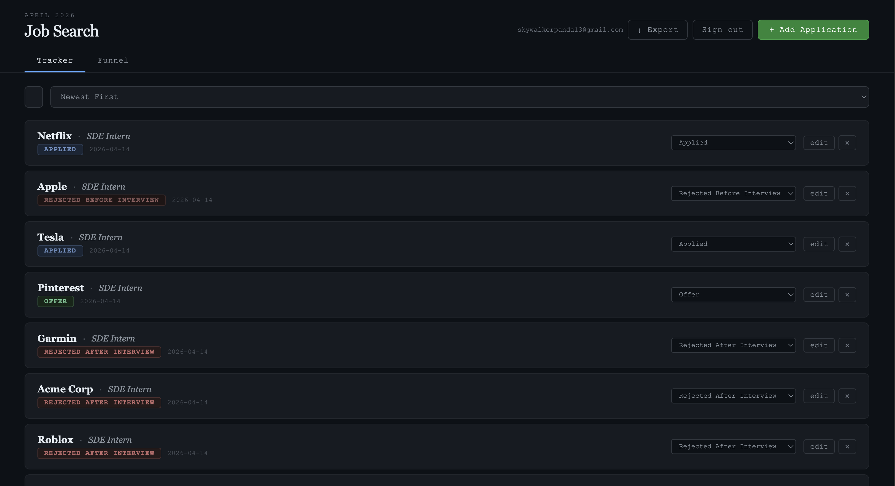
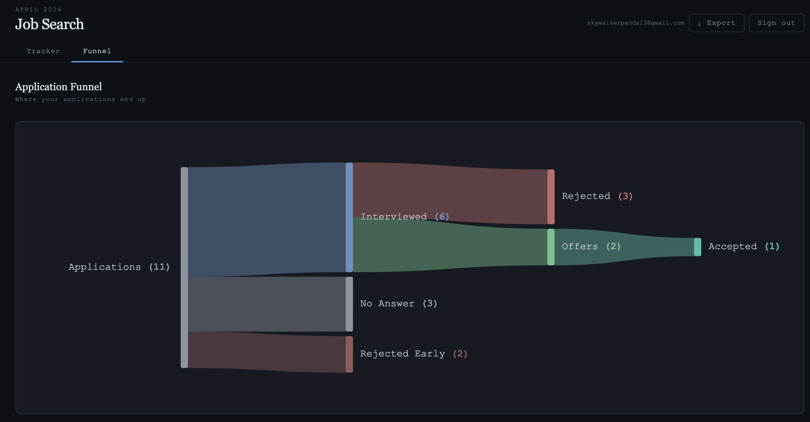

# Job Tracker

A personal job application tracker built as a single `index.html` — no frameworks, no build step, no install. Login with email and password, and your data syncs to the cloud via Firebase.

## Features

- **6 application stages** — Applied, Interviewed, Rejected After Interview, Rejected Before Interview, Offer, Accepted
- **Sankey funnel diagram** to visualize where applications are going
- **Real-time sync** via Firestore — data persists across devices
- **Private by design** — each account only sees its own data
- Add, edit, delete, and quick-update status inline
- Search and sort by date or company
- Export to CSV as a backup

## Stack

- Vanilla HTML, CSS, JavaScript (zero dependencies)
- Firebase Authentication — email/password
- Cloud Firestore — real-time database
- GitHub Pages — hosting

## Setup

1. Clone the repo
2. Open `https://sandeeptha-notabot.github.io/ApplyTrack/` in a browser — no server needed
3. Sign up with any email and password

> Data is stored in Firestore and tied to your account. Nothing is saved in the browser.